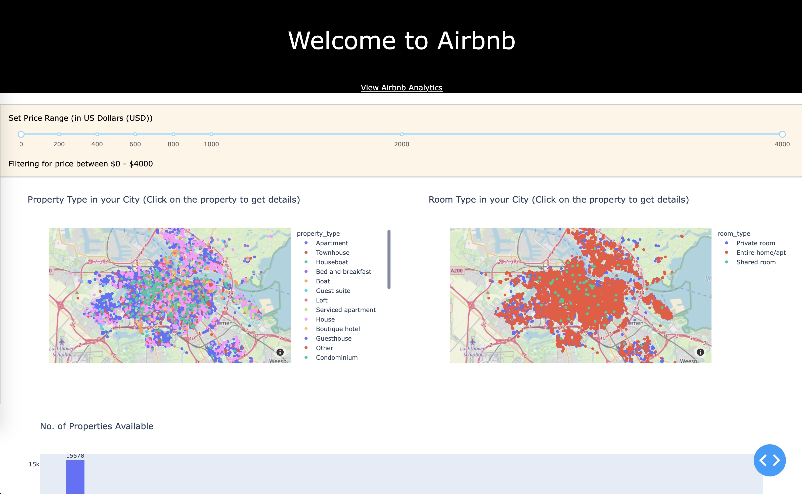
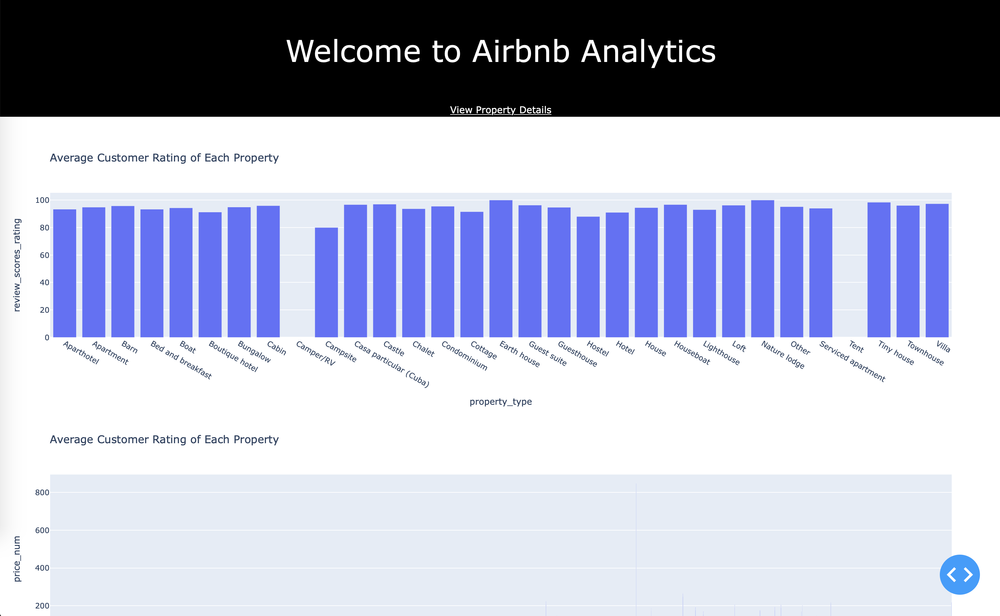

# Airbnb Data Analytics
A Full stack data analytics and visualization project developed 
using Dash Framework. 

**About Airbnb**

 Airbnb offers arrangement for lodging, primarily homestays, or tourism experiences.
 
**About the Dataset**

 The Data Set used here is a `listings_details.csv` file that has information about the 
 properties listed on Airbnb in Amsterdam, Netherlands. This file downlaoded from insideairbnb.com 
 gives a snapshot of the Amsterdam situation on December 6th, 2018.
 
 If required view the complete dataset [here](https://www.kaggle.com/erikbruin/airbnb-amsterdam?select=listings_details.csv).

**Project Setup**

1) Pull the git repository

2) Install the requirements from the `requirement.txt` file in the root dir.

3) Execute the following python script.
      * Execute the script `airbnb_property_details.py` to view the property details page.
        Access the property details page on http://127.0.0.1:5000/property-details.
        
         The Airbnb Property Dashboards is a web portal where you can view all the properties and
         filter them according to your needs. It contains the detailed information of each porperty.
         Just click on the property on the map to view details.
        
         
 
      * Now to view analytics dashboard click on the link `View Airbnb Analytics` below the page heading or
        visit http://127.0.0.1:5000/analytics to view your dashboard.
     
         The Analytics Dashboards contains the visual representation of Airbnb data.
        
         
    
